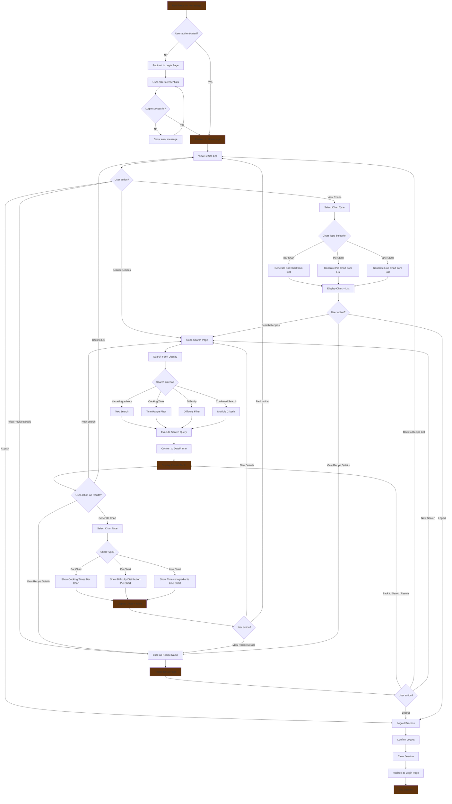

# Task 2.7: Recipe Search and Data Analysis

## Project Analysis

### Current Recipe App Structure

- **Model**: Recipe with fields: name, short_description, ingredients, cooking_time, difficulty, likes, comments, references, recipe_image
- **Current Data**: 5 recipes with varying cooking times (5-15 min), difficulties (Medium-Hard), and ingredient counts (6-8)
- **Existing Views**: Home, Recipe List, Recipe Detail
- **Authentication**: Login required for recipe access

### Search Criteria Suggestions

#### 1. **Primary Search Fields** (Most Useful for Users)

- **Recipe Name**: Text search with partial matching
- **Ingredients**: Search by specific ingredients (e.g., "tomato", "pasta", "cheese")
- **Cooking Time Range**: Filter by time constraints (e.g., "under 10 minutes", "15-30 minutes")
- **Difficulty Level**: Filter by Easy, Medium, Intermediate, Hard

#### 2. **Secondary Search Fields** (For Advanced Users)

- **Short Description**: Search within recipe descriptions
- **Number of Ingredients**: Filter by ingredient count (e.g., "simple recipes with 5 or fewer ingredients")
- **Likes Count**: Sort by popularity

#### 3. **Search Types to Implement**

- **Text Search**: Name, ingredients, description (with partial matching)
- **Range Search**: Cooking time, ingredient count
- **Exact Match**: Difficulty level
- **Combined Search**: Multiple criteria simultaneously

### Search Output Format

#### 1. **Table Display** (Primary Requirement)

- Recipe Name (clickable link to detail page)
- Cooking Time
- Difficulty
- Number of Ingredients
- Short Description (truncated)
- Recipe Image (thumbnail)

#### 2. **Search Results Features**

- **Clickable Recipe Names**: Link to recipe detail page
- **Sortable Columns**: Allow sorting by time, difficulty, ingredients count
- **Pagination**: Handle large result sets
- **Result Count**: Show "X recipes found"

#### 3. **Data Analysis Opportunities**

- **Cooking Time Distribution**: Histogram of cooking times
- **Difficulty Distribution**: Pie chart of difficulty levels
- **Ingredient Analysis**: Most common ingredients
- **Popularity Metrics**: Recipes with most likes

### Implementation Strategy

#### 1. **Search Form Design**

- **Simple Search**: Single text input for name/ingredients
- **Advanced Search**: Multiple fields with dropdowns and ranges
- **Search Suggestions**: Auto-complete for ingredients
- **Clear Filters**: Reset button to clear all search criteria

#### 2. **QuerySet to DataFrame Conversion**

- Use pandas to convert Django QuerySet to DataFrame
- Add calculated columns (ingredient count, difficulty score)
- Prepare data for visualization

#### 3. **Visualization Components**

- **Summary Statistics**: Average cooking time, most common difficulty
- **Charts**: Bar charts for cooking time distribution, pie charts for difficulty
- **Interactive Elements**: Clickable charts that filter results

### Technical Considerations

#### 1. **Database Optimization**

- Add database indexes on searchable fields
- Use Django's Q objects for complex queries
- Implement full-text search for better performance

#### 2. **User Experience**

- **Progressive Enhancement**: Start with basic search, add advanced features
- **Responsive Design**: Ensure search works on mobile devices
- **Loading States**: Show loading indicators during search
- **Error Handling**: Graceful handling of no results

#### 3. **Performance**

- **Caching**: Cache frequent search results
- **Pagination**: Limit results per page
- **Lazy Loading**: Load images as needed

### Bonus Features (Wild Card & Partial Search)

#### 1. **Partial Matching**

- **Name Search**: "Pasta" matches "Pasta al Pesto", "Pasta alla Carbonara"
- **Ingredient Search**: "cheese" matches recipes containing "Parmesan cheese", "mozzarella cheese"
- **Description Search**: "quick" matches recipes with "quick and easy" in description

#### 2. **Wild Card Implementation**

- **Asterisk Wildcards**: "pasta\*" matches "pasta", "pastas", "pasta-based"
- **Question Mark Wildcards**: "pasta?" matches "pasta" but not "pastas"
- **Fuzzy Search**: Handle typos and variations

#### 3. **Search Suggestions**

- **Auto-complete**: Suggest recipe names and ingredients as user types
- **Related Searches**: "People also searched for..."
- **Search History**: Remember recent searches

### Data Analysis & Visualization Goals

#### 1. **Recipe Analytics Dashboard**

- **Overview Metrics**: Total recipes, average cooking time, most popular difficulty
- **Trend Analysis**: Recipe distribution by difficulty and time
- **Ingredient Insights**: Most common ingredients across all recipes

#### 2. **Interactive Visualizations**

- **Cooking Time Histogram**: Distribution of cooking times
- **Difficulty Pie Chart**: Breakdown of difficulty levels
- **Ingredient Word Cloud**: Visual representation of common ingredients
- **Recipe Complexity Scatter Plot**: Cooking time vs. ingredient count

#### 3. **Export Capabilities**

- **CSV Export**: Download search results as CSV
- **PDF Reports**: Generate printable recipe summaries
- **Data Insights**: Export analytics data for further analysis

### Implementation Priority

#### Phase 1: Basic Search

1. Create search form with name and ingredient fields
2. Implement basic QuerySet filtering
3. Display results in table format
4. Make recipe names clickable

#### Phase 2: Enhanced Search

1. Add cooking time and difficulty filters
2. Implement partial matching and wildcards
3. Add sorting and pagination
4. Convert to pandas DataFrame

#### Phase 3: Data Visualization

1. Add summary statistics
2. Create basic charts (histogram, pie chart)
3. Implement interactive filtering
4. Add export functionality

#### Phase 4: Advanced Features

1. Auto-complete and search suggestions
2. Advanced analytics dashboard
3. Performance optimization
4. Mobile responsiveness

This approach provides a comprehensive yet manageable scope for a data analysis and visualization lesson, with clear progression from basic search to advanced analytics features.

## Data Analysis

### Chart Implementations

#### 1. Bar Chart (#1) - Recipe Cooking Times

- **Purpose**: Visualize cooking time distribution across recipes
- **X-axis**: Recipe names (categorical data)
- **Y-axis**: Cooking time in minutes (numerical data)
- **Labels**:
  - X-axis: "Recipe Name"
  - Y-axis: "Cooking Time (minutes)"
  - Title: "Recipe Cooking Times"
- **Display Logic**: Based on user input - user selects "Bar chart" from dropdown
- **Data Source**: `data["name"]` and `data["cooking_time"]` from pandas DataFrame
- **Use Case**: Helps users quickly identify which recipes take the longest/shortest time

#### 2. Pie Chart (#2) - Difficulty Distribution

- **Purpose**: Show the distribution of difficulty levels in the recipe collection
- **Data**: Difficulty level counts (Easy, Medium, Intermediate, Hard)
- **Labels**:
  - Each slice labeled with difficulty level
  - Percentage values displayed on each slice
  - Title: "Recipe Difficulty Distribution"
- **Display Logic**: Based on user input - user selects "Pie chart" from dropdown
- **Data Source**: `data["difficulty"].value_counts()` from pandas DataFrame
- **Use Case**: Provides overview of recipe collection complexity and helps users understand available difficulty levels

#### 3. Line Chart (#3) - Cooking Time vs Ingredient Count

- **Purpose**: Analyze the relationship between recipe complexity (ingredients) and cooking time
- **X-axis**: Number of ingredients (numerical data)
- **Y-axis**: Cooking time in minutes (numerical data)
- **Labels**:
  - X-axis: "Number of Ingredients"
  - Y-axis: "Cooking Time (minutes)"
  - Title: "Cooking Time vs Number of Ingredients"
- **Display Logic**: Based on user input - user selects "Line chart" from dropdown
- **Data Source**: `data["ingredient_count"]` and `data["cooking_time"]` from pandas DataFrame
- **Use Case**: Reveals patterns between recipe complexity and preparation time

### Chart Display Strategy

**User-Driven Display**: All charts are displayed based on user input through the chart type dropdown in the search form. This approach:

1. **Gives users control** over which visualization they want to see
2. **Reduces cognitive load** by showing only one chart at a time
3. **Allows focused analysis** on specific aspects of the data
4. **Maintains clean interface** without overwhelming users with multiple charts

**Chart Selection Process**:

1. User performs search (with or without filters)
2. User selects desired chart type from dropdown
3. System generates appropriate visualization based on search results
4. Chart displays alongside the data table

### Technical Implementation

**Chart Generation**:

- Uses matplotlib with AGG backend for PNG generation
- Charts converted to base64 images for HTML display
- Responsive design with proper sizing (8x5 figure size)
- Custom styling with titles, labels, and formatting

**Data Processing**:

- Pandas DataFrame provides clean data structure
- Calculated columns (ingredient_count) added for analysis
- Data filtered based on search criteria before visualization
- Handles empty results gracefully

**Integration**:

- Charts generated in `utils.py` using `get_chart()` function
- View passes chart type and data to utility function
- Template displays chart as base64 image
- Maintains same data context between table and chart views

## Execution Flow

The following flowchart represents the complete user journey through the recipe application, from initial landing to logout, including all navigation possibilities and search options:

### User Journey Scenarios

#### Scenario 1: New User Experience

1. **Landing**: User visits homepage → redirected to login
2. **Authentication**: User creates account or logs in
3. **Exploration**: Views recipe list to understand available content
4. **Search**: Searches for "pasta" recipes
5. **Analysis**: Views bar chart of cooking times
6. **Detail View**: Clicks on specific recipe to see full details
7. **Navigation**: Returns to search results
8. **Logout**: Ends session

#### Scenario 2: Returning User - Quick Search

1. **Landing**: User visits homepage → already authenticated
2. **Direct Search**: Goes straight to search page
3. **Filtered Search**: Searches for "Easy" difficulty recipes under 10 minutes
4. **Results**: Views filtered table with 3 recipes
5. **Visualization**: Generates pie chart showing difficulty distribution
6. **Selection**: Clicks on preferred recipe
7. **Quick Exit**: Logs out after viewing recipe

#### Scenario 3: Data Analysis Focus

1. **Landing**: Authenticated user lands on homepage
2. **Overview**: Views complete recipe list
3. **Chart Analysis**: Generates line chart (cooking time vs ingredients)
4. **Pattern Recognition**: Identifies that more ingredients ≠ longer cooking time
5. **Targeted Search**: Searches for recipes with 6+ ingredients
6. **Comparison**: Views bar chart of cooking times for complex recipes
7. **Decision**: Selects recipe based on analysis
8. **Session End**: Logs out

### Key Navigation Paths

#### Primary Navigation Options

- **Homepage ↔ Recipe List**: Direct access to all recipes
- **Recipe List ↔ Search**: Quick access to search functionality
- **Search ↔ Results**: Seamless transition between search and results
- **Results ↔ Detail**: One-click access to full recipe information
- **Any Page ↔ Charts**: Chart generation available from multiple entry points

#### Search Flow Variations

- **Simple Search**: Name/ingredient text search → results → details
- **Advanced Search**: Multiple criteria → filtered results → analysis charts
- **Chart-First Approach**: List view → chart selection → data analysis → targeted search

#### Exit Strategies

- **Quick Exit**: Any page → logout → session end
- **Exploration Exit**: Search → results → details → logout
- **Analysis Exit**: Charts → insights → logout

This execution flow ensures users can efficiently navigate through all application features while maintaining clear paths for different use cases, from quick recipe lookup to comprehensive data analysis.
